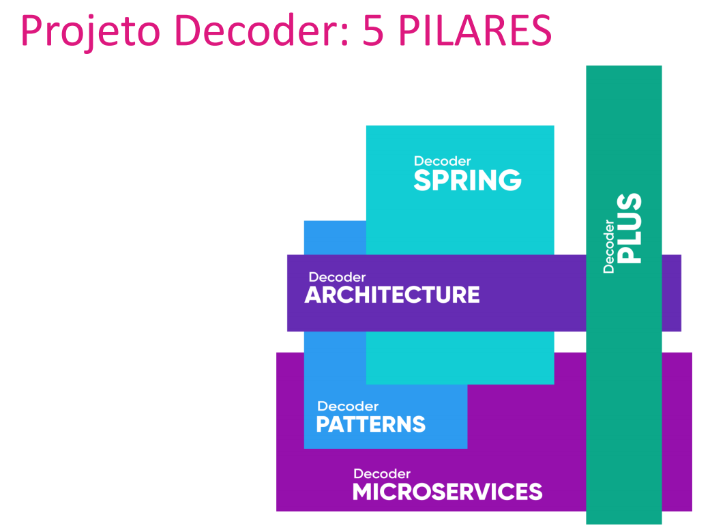

# EAD - ARQUITETURA DE MICROSERVIÇOS

A aplicação é um projeto Formação de Especialista em Microservices Java com Spring feito pela <strong>Decoder Project</strong>. 
Este projeto é baseado na arquitetura de microserviços, desenvolvida utilizando Java com o framework Spring. Essa arquitetura proporciona escalabilidade, flexibilidade e facilidade de manutenção.
A aplicação consiste em vários microserviços independentes, cada um responsável por uma funcionalidade específica. Cada microserviço é desenvolvido e implantado separadamente, permitindo que eles sejam escalados individualmente de acordo com a demanda e possam ser atualizados de forma independente, sem afetar os outros componentes do sistema.

Este é um projeto onde o foco não foram as regras de negócios, e sim compreender e ter a experiência de como estruturar e implementar uma arquitetura de microserviços com seus padrões e utilizar vários projetos do ecossistema Spring. 
Falando um pouco do que se trata a aplicação, é uma plataforma EAD contém cursos, módulos e lições onde usuários podem se inscrever após realizem o pagamento para ter acesso a plataforma. Após um usuário se inscrever em um determinado curso, uma notificação de boas vindas é enviada para o aluno. Também existem os instrutores que são responsáveis por cada curso. Nesse projeto podemos utilizar de várias abordagens e padrões utilizadas no mercado quando se trata de sistemas distribuídos. 

## A arquitetura contempla os principais pilares e padrões de uma arquitetura de microserviços:

<strong>API Gateway</strong>: Um ponto de entrada único para os clientes se comunicarem com vários microservices, facilitando o roteamento, a autenticação e o controle de acesso.

<strong>Service Discovery</strong>: Um mecanismo que permite que os microservices localizem dinamicamente uns aos outros em um ambiente distribuído, facilitando a comunicação entre eles.

<strong>Cross Cutting</strong>: Conceitos e funcionalidades que são compartilhados por vários microservices, como autenticação, registro de logs e monitoramento, sendo implementados de forma centralizada.

<strong>Security</strong>: A aplicação de medidas de segurança, como autenticação, autorização e criptografia, para proteger os microservices e os dados que trafegam entre eles.

<strong>State Transfer</strong>: O conceito de que os microservices devem ser independentes e não compartilhar estado, o que melhora a escalabilidade, a flexibilidade e a resiliência do sistema.

<strong>Event Driven</strong>: Uma abordagem em que os microservices reagem e se comunicam por meio de eventos assíncronos, permitindo um acoplamento fraco e uma maior escalabilidade.

<strong>Brokers</strong>: Plataformas de mensageria como o Rabbitmq facilitam a troca de mensagens entre os microservices, proporcionando a comunicação assíncrona e o gerenciamento de eventos.

<strong>Resilience</strong>: Utilizado o Resilience4j para os microservices ser capaz de lidar com falhas e se recuperar delas, por meio de técnicas como retries, circuit breakers e fallbacks, garantindo a disponibilidade e a confiabilidade do sistema.

Load Balancing<strong></strong>: A distribuição equilibrada do tráfego entre os microservices, garantindo a escalabilidade horizontal e a utilização eficiente dos recursos.

Global Config<strong></strong>: Componente  que permite centralizar e gerenciar a configuração de vários serviços em uma aplicação distribuída, facilitando o versionamento e a atualização da configuração de forma dinâmica.

## Aqui Podemos ter uma visão ampla de como a arquitetura funciona

## Todos ensinamentos que vimos durante o projeto

